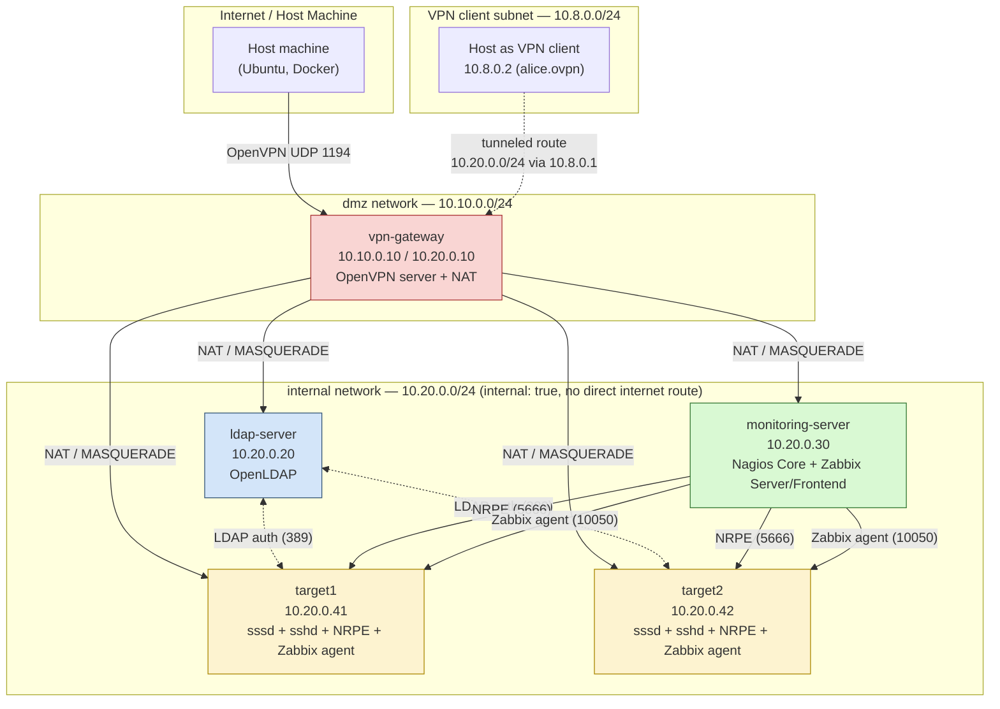

# Enterprise Infra Lab

A hands-on lab that replicates traditional enterprise infrastructure on a single Ubuntu host using Docker containers instead of full VMs:

- **Centralized authentication** via OpenLDAP
- **Secure remote access** via OpenVPN (certificate-based, per-user)
- **Dual monitoring stack**: Nagios Core (classic, plugin-based) and Zabbix (modern, agent-based)

The goal was to get real, hands-on answers to two questions that come up constantly in DevOps interviews: *"Have you worked with LDAP?"* and *"Nagios vs Zabbix — which do you prefer and why?"*

---

## Architecture

Five containers on two isolated Docker bridge networks. Only `vpn-gateway` touches both networks, so it is the single choke point between the outside world and the private subnet — exactly like a real VPN gateway.



**Why this topology matters:** `target1`, `target2`, `ldap-server`, and `monitoring-server` sit on an `internal: true` Docker network, which has no route to the internet by construction. The only way in or out is through `vpn-gateway`, which straddles both networks and does NAT (`iptables MASQUERADE`) for outbound internet access and terminates the OpenVPN tunnel for inbound access. A firewall rule on each target additionally restricts SSH to only the VPN client subnet (`10.8.0.0/24`), so even a machine on the same physical host cannot SSH into a target without first connecting to the VPN.

---

## Repository structure

```
enterprise-infra-lab/
├── docker-compose.yml          # 5-container topology (dmz + internal networks)
├── ldap/
│   ├── bootstrap/01-structure.ldif   # OUs, users, groups (LDIF)
│   └── README.md
├── vpn/
│   ├── clients/alice.ovpn      # per-user OpenVPN client config (cert embedded)
│   └── README.md
├── nagios/README.md
├── zabbix/README.md
├── scripts/
│   ├── restart-services.sh     # re-starts all manually-managed services after a container/host restart
│   └── full-rebuild.sh         # full from-scratch reinstall of every component
└── docs/
    ├── network-isolation-proof.md
    ├── nat-gateway-setup.md
    ├── ldap-setup.md
    ├── ldap-ssh-integration.md
    ├── sudo-restriction.md
    ├── ldap-multi-server-proof.md
    ├── vpn-setup.md
    ├── nagios-setup.md
    ├── comparison.md            # Nagios vs Zabbix write-up
    └── screenshots/
```

---

## Environment setup

Instead of 3–4 full VMs, the whole fleet runs as Docker containers on one Ubuntu machine — much lighter, and the Docker bridge networking still lets us simulate a realistic private-subnet-behind-a-gateway topology.

**`docker-compose.yml`** (trimmed):

```yaml
networks:
  dmz:
    driver: bridge
    ipam:
      config:
        - subnet: 10.10.0.0/24
  internal:
    driver: bridge
    internal: true          # no direct internet route — simulates a private VM subnet
    ipam:
      config:
        - subnet: 10.20.0.0/24

services:
  vpn-gateway:
    image: ubuntu:22.04
    cap_add: [NET_ADMIN]
    networks:
      dmz: { ipv4_address: 10.10.0.10 }
      internal: { ipv4_address: 10.20.0.10 }
    command: sleep infinity

  ldap-server:
    image: ubuntu:22.04
    networks: { internal: { ipv4_address: 10.20.0.20 } }
    command: sleep infinity

  monitoring-server:
    image: ubuntu:22.04
    networks: { internal: { ipv4_address: 10.20.0.30 } }
    command: sleep infinity

  target1:
    image: ubuntu:22.04
    cap_add: [NET_ADMIN]
    networks: { internal: { ipv4_address: 10.20.0.41 } }
    command: sleep infinity

  target2:
    image: ubuntu:22.04
    cap_add: [NET_ADMIN]
    networks: { internal: { ipv4_address: 10.20.0.42 } }
    command: sleep infinity
```

```bash
docker compose up -d
docker compose ps
```

**Proof of isolation** — `target1` cannot reach the internet, but `vpn-gateway` (which bridges both networks) can:

```
$ docker exec target1 apt-get update
Ign:1 http://archive.ubuntu.com/ubuntu jammy InRelease   # no route out

$ docker exec vpn-gateway apt-get update
Get:1 http://security.ubuntu.com/ubuntu jammy-security InRelease [129 kB]   # works fine
```

### Giving the internal network internet access (NAT)

Package installs on the internal hosts still need internet at *setup* time, so `vpn-gateway` is turned into a NAT router — exactly the role a real VPN gateway plays:

```bash
# On vpn-gateway
docker exec vpn-gateway sh -c "echo 1 > /proc/sys/net/ipv4/ip_forward"   # (persisted via docker-compose sysctls in production)
docker exec vpn-gateway iptables -t nat -A POSTROUTING -s 10.20.0.0/24 -o eth0 -j MASQUERADE

# On each internal container: point default route at the gateway
sudo nsenter -t <container_pid> -n ip route add default via 10.20.0.10

# Docker's embedded DNS (127.0.0.11) can't resolve externally on an internal-only
# network, so each container's resolver is pointed at a public DNS server:
docker exec <container> sh -c "echo 'nameserver 1.1.1.1' > /etc/resolv.conf"
```

Result: `apt-get update` now succeeds on every internal container, while the containers still have zero direct route to the internet without going through the gateway.

---

## 1. Centralized Authentication — OpenLDAP

**Server:** `ldap-server` (10.20.0.20), base DN `dc=example,dc=local`.

```bash
docker exec ldap-server bash -c "
debconf-set-selections <<< 'slapd slapd/root_password password Admin@123'
debconf-set-selections <<< 'slapd slapd/root_password_again password Admin@123'
debconf-set-selections <<< 'slapd slapd/domain string example.local'
DEBIAN_FRONTEND=noninteractive apt-get install -y slapd ldap-utils
"
docker exec ldap-server service slapd start
```

### Directory structure

`ldap/bootstrap/01-structure.ldif` defines:

- `ou=People,dc=example,dc=local`, `ou=Groups,dc=example,dc=local`
- Users: **alice** (uid 10001), **bob** (uid 10002), **carol** (uid 10003)
- Groups: **admins** (gid 20001, member: alice), **developers** (gid 20002, members: bob, carol)

```bash
docker cp ldap/bootstrap/01-structure.ldif ldap-server:/tmp/01-structure.ldif
docker exec ldap-server ldapadd -x -D "cn=admin,dc=example,dc=local" -w Admin@123 -f /tmp/01-structure.ldif
docker exec ldap-server ldappasswd -x -D "cn=admin,dc=example,dc=local" -w Admin@123 -s "Alice@123" "uid=alice,ou=People,dc=example,dc=local"
```

**Verification:**

```
$ ldapsearch -x -b "dc=example,dc=local" -D "cn=admin,dc=example,dc=local" -w Admin@123 "(objectClass=*)"
...
# admins, Groups, example.local
dn: cn=admins,ou=Groups,dc=example,dc=local
cn: admins
memberUid: alice

search: 2
result: 0 Success
numResponses: 9
numEntries: 8
```

### Making target1 / target2 LDAP clients (sssd)

```bash
docker exec target1 bash -c "DEBIAN_FRONTEND=noninteractive apt-get install -y openssh-server sssd sssd-ldap libnss-sss libpam-sss ldap-utils sudo"

docker exec target1 bash -c "cat > /etc/sssd/sssd.conf << 'EOF'
[sssd]
logger = files
services = nss, pam
domains = example.local

[domain/example.local]
id_provider = ldap
auth_provider = ldap
ldap_uri = ldap://10.20.0.20
ldap_search_base = dc=example,dc=local
ldap_default_bind_dn = cn=admin,dc=example,dc=local
ldap_default_authtok = Admin@123
ldap_tls_reqcert = never
ldap_id_use_start_tls = false
ldap_auth_disable_tls_never_use_in_production = true
EOF"

# nsswitch.conf: passwd/group/shadow -> "files sss"
docker exec target1 sed -i 's/^passwd:.*/passwd: files sss/' /etc/nsswitch.conf

docker exec target1 sssd -D
docker exec target1 service ssh start
```

> **Key gotcha:** sssd attempts StartTLS during authentication by default, separately from ID lookups, even with `ldap_id_use_start_tls=false`. Since this lab's OpenLDAP is plain LDAP (internal-only network, already gated by NAT + a planned VPN layer), authentication failed with `unsupported extended operation` until `ldap_auth_disable_tls_never_use_in_production = true` was set. **This is a lab-only setting** — a real production deployment should use LDAPS or StartTLS with valid certificates.

### Group-based sudo restriction

```bash
docker exec target1 bash -c "echo '%admins ALL=(ALL:ALL) ALL' > /etc/sudoers.d/ldap-admins"
```

**Test — alice (admins) can sudo, bob (developers) cannot:**

```
$ ssh alice@10.20.0.41 "echo 'Alice@123' | sudo -S whoami"
root

$ ssh bob@10.20.0.41 "echo 'Bob@123' | sudo -S whoami"
[sudo] password for bob: bob is not in the sudoers file. This incident will be reported.
```

### Proof: one identity, multiple servers

```
$ ssh alice@10.20.0.41 "whoami && id"      # target1
alice
uid=10001(alice) gid=10001 groups=10001,20001(admins)

$ ssh alice@10.20.0.42 "whoami && id"      # target2 — same password, same identity
alice
uid=10001(alice) gid=10001 groups=10001,20001(admins)
```

No local account was ever created on either target — LDAP is the single source of truth.

---

## 2. Secure Remote Access — OpenVPN

**Server:** `vpn-gateway`, listening on `10.10.0.10:1194/udp`, pushing route `10.20.0.0/24` to connected clients.

### PKI: one certificate per user

```bash
docker exec vpn-gateway apt-get install -y openvpn easy-rsa
docker exec vpn-gateway bash -c "cd /etc/openvpn/easy-rsa && ./easyrsa init-pki"
docker exec vpn-gateway bash -c "cd /etc/openvpn/easy-rsa && EASYRSA_BATCH=1 ./easyrsa build-ca nopass"
docker exec vpn-gateway bash -c "cd /etc/openvpn/easy-rsa && EASYRSA_BATCH=1 ./easyrsa gen-req server nopass"
docker exec vpn-gateway bash -c "cd /etc/openvpn/easy-rsa && EASYRSA_BATCH=1 ./easyrsa sign-req server server"
docker exec vpn-gateway bash -c "cd /etc/openvpn/easy-rsa && ./easyrsa gen-dh"

# One cert per user — note EASYRSA_REQ_CN, otherwise every cert defaults to CN=ChangeMe
docker exec vpn-gateway bash -c "cd /etc/openvpn/easy-rsa && EASYRSA_BATCH=1 EASYRSA_REQ_CN=alice ./easyrsa gen-req alice nopass"
docker exec vpn-gateway bash -c "cd /etc/openvpn/easy-rsa && EASYRSA_BATCH=1 ./easyrsa sign-req client alice"
docker exec vpn-gateway bash -c "cd /etc/openvpn/easy-rsa && EASYRSA_BATCH=1 EASYRSA_REQ_CN=bob ./easyrsa gen-req bob nopass"
docker exec vpn-gateway bash -c "cd /etc/openvpn/easy-rsa && EASYRSA_BATCH=1 ./easyrsa sign-req client bob"
```

```
$ openssl x509 -in pki/issued/alice.crt -noout -subject
subject=CN = alice
$ openssl x509 -in pki/issued/bob.crt -noout -subject
subject=CN = bob
```

### Server config (`/etc/openvpn/server.conf`)

```
port 1194
proto udp
dev tun
ca /etc/openvpn/easy-rsa/pki/ca.crt
cert /etc/openvpn/easy-rsa/pki/issued/server.crt
key /etc/openvpn/easy-rsa/pki/private/server.key
dh /etc/openvpn/easy-rsa/pki/dh.pem
tls-auth /etc/openvpn/easy-rsa/pki/ta.key 0
topology subnet
server 10.8.0.0 255.255.255.0
push "route 10.20.0.0 255.255.255.0"
keepalive 10 120
cipher AES-256-CBC
```

```bash
docker exec vpn-gateway mknod /dev/net/tun c 10 200 && chmod 600 /dev/net/tun
docker exec vpn-gateway openvpn --config /etc/openvpn/server.conf --daemon --log /var/log/openvpn.log
```

Client configs (`vpn/clients/alice.ovpn`) bundle the CA cert, the user's own cert/key, and the `tls-auth` key inline — a single self-contained file per user.

### Firewall: SSH only from the VPN subnet

```bash
docker exec target1 iptables -A INPUT -p tcp --dport 22 -s 10.8.0.0/24 -j ACCEPT
docker exec target1 iptables -A INPUT -p tcp --dport 22 -j DROP
```

### Proof: unreachable without VPN, reachable with VPN

```
# Without VPN connected:
$ ssh alice@10.20.0.41 "whoami"
ssh: connect to host 10.20.0.41 port 22: Connection timed out

# Connect to VPN:
$ sudo openvpn --config vpn/clients/alice.ovpn --daemon
...
Initialization Sequence Completed

# With VPN connected:
$ ssh alice@10.20.0.41 "whoami && id && hostname"
alice
uid=10001(alice) gid=10001 groups=10001,20001(admins)
target1
```

> **Lab-only caveat:** since this is a single-host Docker lab, the host machine already has a route to the `internal` Docker bridge, which would otherwise bypass the tunnel entirely. A more specific host route (`ip route add 10.20.0.41/32 via 10.8.0.1 dev tun0`) was added on the client to force traffic through the tunnel, as it would be by construction on a real multi-machine deployment.

---

## 3. Monitoring — Nagios Core (classic, plugin-based)

**Server:** `monitoring-server` (10.20.0.30), web UI at `http://10.20.0.30/nagios4/`.

```bash
docker exec monitoring-server apt-get install -y nagios4 nagios-plugins-contrib monitoring-plugins nagios-nrpe-plugin
docker exec monitoring-server htpasswd -b -c /etc/nagios4/htdigest.users nagiosadmin Admin@123
docker exec monitoring-server a2enmod cgi        # required — otherwise CGI pages download as files instead of rendering
docker exec monitoring-server rm /etc/nginx/sites-enabled/default  # (not applicable here — Apache default vhost was the real conflict)
```

**NRPE on each target** (remote check execution):

```bash
docker exec target1 apt-get install -y nagios-nrpe-server monitoring-plugins
docker exec target1 sed -i 's/^allowed_hosts=.*/allowed_hosts=127.0.0.1,10.20.0.30/' /etc/nagios/nrpe.cfg
docker exec target1 bash -c "cat >> /etc/nagios/nrpe.cfg << 'EOF'
command[check_disk]=/usr/lib/nagios/plugins/check_disk -w 20% -c 10% -p /
command[check_load]=/usr/lib/nagios/plugins/check_load -w 5,4,3 -c 10,8,6
EOF"
docker exec target1 /usr/sbin/nrpe -c /etc/nagios/nrpe.cfg -d
```

**Host/service definitions** (`nagios/conf.d/targets.cfg` on the server): host blocks for target1/target2, and service checks for PING, SSH, Disk Space (`check_nrpe_1arg!check_disk`), CPU Load (`check_nrpe_1arg!check_load`), plus a custom `check_nrpe_1arg` command definition (not included by default).

```bash
docker exec monitoring-server nagios4 -v /etc/nagios4/nagios.cfg   # validate config
docker exec monitoring-server service nagios4 start
```

### Disk-fill alert test

```bash
docker exec target1 dd if=/dev/zero of=/tmp/fillfile bs=1M count=90000
$ docker exec monitoring-server /usr/lib/nagios/plugins/check_nrpe -H 10.20.0.41 -c check_disk
DISK CRITICAL - free space: / 8093 MB (4% inode=91%)
```

The Nagios web UI correctly flipped the Disk Space service for `target1` from OK to CRITICAL (see `docs/screenshots/nagios-disk-critical.png`).

> **Note on the SSH check showing CRITICAL:** this is *expected*, not a bug — the target's firewall only accepts SSH from the VPN subnet (10.8.0.0/24), and `monitoring-server` isn't on that subnet. It's the same security control from Section 2 correctly doing its job.

---

## 4. Monitoring — Zabbix (modern, agent-based)

**Server:** `monitoring-server`, backed by MariaDB, web UI at `http://10.20.0.30:8080/` (nginx + PHP-FPM, deliberately on a different port from Nagios's Apache on port 80).

```bash
docker exec monitoring-server apt-get install -y mariadb-server
docker exec monitoring-server service mariadb start

docker exec monitoring-server curl -o /tmp/zabbix-release.deb \
  https://repo.zabbix.com/zabbix/6.4/ubuntu/pool/main/z/zabbix-release/zabbix-release_6.4-1+ubuntu22.04_all.deb
docker exec monitoring-server dpkg -i /tmp/zabbix-release.deb
docker exec monitoring-server apt-get update
docker exec monitoring-server apt-get install -y zabbix-server-mysql zabbix-frontend-php zabbix-nginx-conf zabbix-sql-scripts zabbix-agent

docker exec monitoring-server mysql -e "CREATE DATABASE zabbix CHARACTER SET utf8mb4 COLLATE utf8mb4_bin;"
docker exec monitoring-server mysql -e "CREATE USER 'zabbix'@'localhost' IDENTIFIED BY 'Zabbix@123';"
docker exec monitoring-server mysql -e "GRANT ALL PRIVILEGES ON zabbix.* TO 'zabbix'@'localhost';"
docker exec monitoring-server bash -c "zcat /usr/share/zabbix-sql-scripts/mysql/server.sql.gz | mysql -u zabbix -pZabbix@123 zabbix"

docker exec monitoring-server sed -i 's/^# DBPassword=.*/DBPassword=Zabbix@123/' /etc/zabbix/zabbix_server.conf
docker exec monitoring-server chmod 755 /var/run/mysqld   # PHP-FPM (www-data) needs to traverse this to reach the socket

docker exec monitoring-server sed -i 's/#        listen          8080;/        listen          8080;/' /etc/zabbix/nginx.conf
docker exec monitoring-server service php8.1-fpm start
docker exec monitoring-server service nginx start
docker exec monitoring-server service zabbix-server start
```

Web setup wizard at `10.20.0.30:8080/setup.php` walks through: pre-requisite checks → DB connection → server name → install.

**Zabbix agent on each target:**

```bash
docker exec target1 apt-get install -y zabbix-agent
docker exec target1 sed -i 's/^# Hostname=.*/Hostname=target1/' /etc/zabbix/zabbix_agentd.conf
docker exec target1 sed -i 's/^Server=127.0.0.1/Server=10.20.0.30/' /etc/zabbix/zabbix_agentd.conf
docker exec target1 service zabbix-agent start
```

Hosts `target1`/`target2` are then created in the Zabbix web UI with interface `10.20.0.41:10050` / `10.20.0.42:10050` and the built-in **"Linux by Zabbix agent"** template attached, which brings dozens of checks (CPU, memory, disk, network) with zero extra configuration.

**Verification:**

```
$ zabbix_get -s 10.20.0.41 -k agent.ping
1
```

The Global View dashboard immediately shows top hosts by CPU, host availability, problems by severity, and a geomap — all built in, no extra plugin needed (see `docs/screenshots/`).

---

## 5. Nagios vs Zabbix — the actual comparison

See [`docs/comparison.md`](docs/comparison.md) for the full write-up. Short version:

| | Nagios Core | Zabbix |
|---|---|---|
| **New host setup** | Manual `.cfg` blocks, custom NRPE commands | Install agent + one config line + attach template in UI |
| **Trending/graphing** | Not built in (needs PNP4Nagios etc.) | Built in from day one, full dashboard |
| **Alerting model** | Simple: check state → notify contacts | Layered: items → triggers → actions (more powerful, more concepts) |
| **Best fit** | Small/simple environments, existing Nagios expertise, huge plugin ecosystem | New builds, many hosts (auto-discovery + templates scale), teams that want a modern UI |

---

## Known lab limitations

- None of the containers run systemd, so every service (`slapd`, `sssd`, `sshd`, `nagios4`, `zabbix-server`, `openvpn`, …) has to be started manually with `service <name> start` or by launching the binary directly — nothing auto-starts on container boot.
- If a container is **restarted**, routes/DNS/running processes are lost and must be re-applied (`scripts/restart-services.sh` automates this).
- If a container is **recreated** (removed and rebuilt from the image, e.g. after a Docker/containerd crash), all installed packages are gone and the full install has to be repeated (`scripts/full-rebuild.sh` automates this, though package-mirror connectivity issues after a rebuild sometimes need manual troubleshooting — usually DNS/IPv6 mirror resolution edge cases in the isolated network).
- The OpenVPN/target-reachability test needed a manual host-route override purely because this is a single-host lab where the client and the "VPN-gated" servers share an underlying Docker bridge; a real multi-machine deployment would not need this.

---

## License

MIT — see [`LICENSE`](LICENSE).
